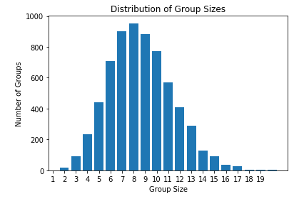

# Data Science Task for a Company

## Introduction

I was given a data science task to complete for a job opportunity. 

There are two exercises in this data task. The first exercise, looks into randomizing a large dataframe (50,000 rows and 8 columns). Each cell would contain one of three variables: "a", "b", and "c". Each row will then be sorted into groups. Where one unique row would be in group size 1, two rows that are the same would be in group size 2, etc. These group sizes are then analysed to see how frequently they appear (no. of groups). Analyses are carried out and a graph is plotted to investigate the distribution of group sizes.

The second task, aims at intvestigating how to handle UK population by postcode data following GDPR within the UK. The dataset given had some postcodes which were not consistent, these postcodes were cleaned. In an attempt to anonymize the data, postcodes were grouped into their outward codes. This data task exercise explores whether it is possible to anonymize UK population by postcode data which follows the GDPR. The GDPR is the legal framework that sets guidelines for the collection and processing of personal information from individuals who live in the European Union. The GDPR protects personal data from being destroyed, altered, stored, or distributed. Personal data is any information about a person that could lead them into being identified. This means that their name, address, income, IP address, gender, etc. must be protected.

## Summary of Findings

From the first task, randomizing a large dataframe was successful and the distribution of group sizes showed a poissonian distribution. This showed that group 8 was the most common group size, and from a privacy point of view, the individuals from those groups would be harder to identify as their variables are less unique. The groups that are most vulnerable would be group size 1 as they have the most unique variables. 

In the GDPR it says that data should be handled in a manner that does not identify the individual. Therefore, I do not think grouping groups of residents that have less than 20,000 would be necessary. The dataframe contains a mix of residential areas and public spaces, which would need to be further cleaned in order to comply with GDPR. I have cleaned the data by setting the postcodes into a standard UK format which would allow consumers to work with the data easily. I have also grouped the postcodes together to comply with GDPR, to protect individual’s information living in England and Wales.

## Learning Outcomes 

* Generated a large random set of values, grouped the values together and found how frequently the groups occurred. 
* Was able to visualize the data using a histogram.
* Worked with real-world postcode data and found methods to best anonymize personal data.
* Written a small report to communicate my findings.

## Libraries Used
Pandas, NumPy, Matplotlib, Seaborn, Random 
